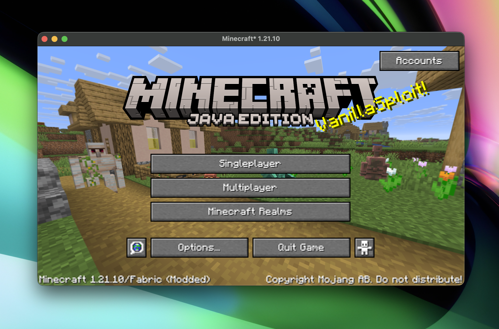
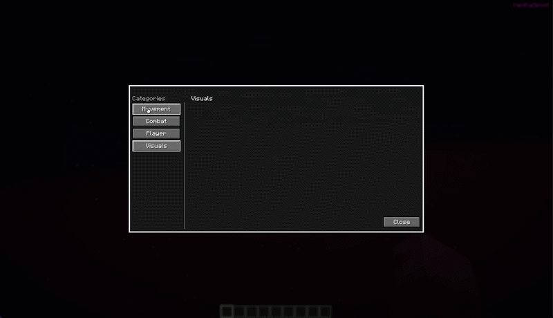
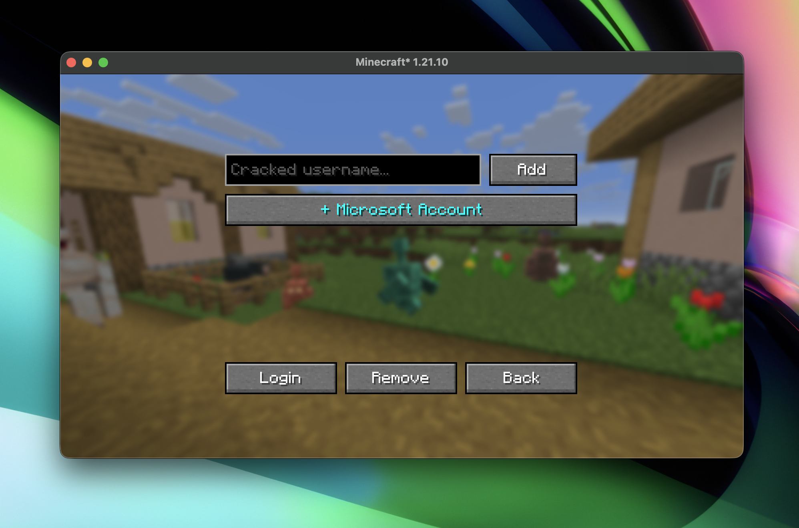

<h1 align="center">VanillaSploit</h1>

<p align="center">
	
</p>

<p align="center">
	VanillaSploit is a Minecraft hacked client with several built-in modules for movement, combat, player utility, and visuals.<br>
	It is built as a skeleton base client that anyone can add onto with their own modules and features.
</p>

## ClickGUI (Modules)

<p align="center">
	
</p>

The ClickGUI groups modules by category and supports per-module keybinds.

| Category | Module | What it does |
| --- | --- | --- |
| Movement | Speed | Increases player movement speed with an adjustable value from 1 to 10. |
| Movement | Fly | Enables creative-style flight with adjustable fly speed. |
| Combat | KillAura | Attacks the nearest valid living target in a short range when cooldown is ready. |
| Combat | Criticals | Sends movement packets before attacks to trigger critical hits while grounded. |
| Player | NoFall | Spoofs on-ground movement packets while falling to prevent fall damage. |
| Player | Scaffold | Auto-places blocks below and around the player while moving, including scaffold down behavior. |
| Visuals | None yet | Visuals category exists in the GUI and is ready for future modules. |

## Alt Manager Showcase

The built-in Alt Manager lets you add cracked accounts, sign in with Microsoft device flow, and switch sessions quickly.

<p align="center">
	
</p>

## Tech Stack

- Minecraft 1.21.10
- Fabric Loader 0.17.2+
- Fabric API 0.134.1+1.21.10
- Java 21
- Gradle (via the included wrapper)

## Requirements

- JDK 21 installed
- Git

## Run In Development

macOS and Linux:

```bash
./gradlew runClient
```

Windows:

```bat
gradlew.bat runClient
```

This launches a Fabric development client using the project source and resources.

## Useful Commands

```bash
./gradlew clean
./gradlew runClient
./gradlew build
```

## Build

macOS and Linux:

```bash
./gradlew build
```

Windows:

```bat
gradlew.bat build
```

Build outputs are written to `build/libs`.

## Contributions

Contributions are accepted.

1. Fork the repository.
2. Create a branch for your change.
3. Keep changes focused and follow the existing code style.
4. Run both commands before opening a pull request:

```bash
./gradlew clean build
./gradlew runClient
```

5. Open a pull request with a clear description of what changed and why.
6. Include screenshots or clips when your change affects UI.

By submitting a contribution, you agree your changes are provided under this project's MIT License.


## Project Layout

- `src/main/java`: shared mod code
- `src/client/java`: client-only code
- `src/main/resources`: mod metadata and common resources
- `src/client/resources`: client resources and mixins

## Educational Use Only

VanillaSploit is made for learning, reverse engineering practice, and client modding research. The project is intentionally structured as a base client so features can be added on quickly. You should use a legitimately purchased Minecraft account, and this project is not intended for cracking or bypassing account ownership. Use it only where you have explicit permission, and always follow server rules and local laws.

## License

This project is licensed under the MIT License.

You can use, modify, and distribute it, including in your own additions, as long as you keep attribution to the original author and include the license text.

See [LICENSE](LICENSE).